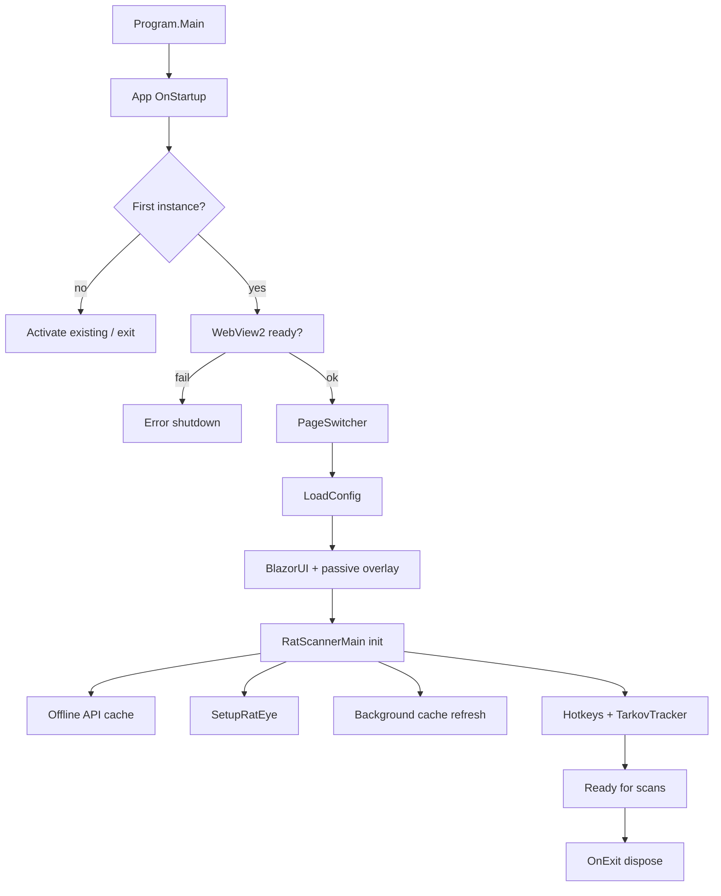

# Architecture

## Process shape

Single Windows process (`StartupObject` = `RatScanner.Program`):

1. `Program.Main` — STA thread, high DPI PerMonitorV2 (`System.Windows.Forms.Application.SetHighDpiMode`), constructs WPF `App`.
2. `App.OnStartup` — single-instance (`SingleInstanceCore` + `RatConfig.SINGLE_INSTANCE_GUID`), splash, set CWD to exe directory, ensure WebView2 runtime (detect or silent install).
3. `App.xaml` `StartupUri` → `PageSwitcher` (main window shell).
4. `PageSwitcher` loads config, shows `BlazorUI`, tray icon, jump list, window mode restore.
5. `BlazorUI` builds DI (`ServiceCollection`), hosts `BlazorWebView`, creates overlay windows sharing that provider.
6. `RatScannerMain` (lazy singleton) initializes API cache, RatEye, hotkeys, TarkovTracker timers.
7. `App.OnExit` disposes `RatScannerMain` and `BlazorUI`, single-instance cleanup, log flush.

Secondary process entry is not used for normal UI; second launches activate the first instance (`ISingleInstance.OnInstanceInvoked`, CLI switches like `/showUI`).

## Why WPF and Windows Forms are both enabled

`UseWPF` and `UseWindowsForms` are both true in `RatScanner.csproj` because:

- **WPF** owns primary windows, chrome, and BlazorWebView hosting.
- **WinForms** supplies `NotifyIcon` tray, multi-monitor `Screen` bounds, and high-DPI mode APIs used from `Program`, `PageSwitcher`, overlays, and display services.

This is intentional hybrid hosting, not accidental dual UI frameworks for product screens.

## Implicit usings

App sets `<ImplicitUsings>disable</ImplicitUsings>`. Keep explicit `using` directives; do not assume global usings exist.

## WPF host responsibilities

| Component | Role |
| --- | --- |
| `PageSwitcher` | Main chrome: title bar, resize, tray minimize, navigate between WPF user controls |
| `BlazorUI` | Primary Blazor shell (`wwwroot/index.html` → `RazorApp`) |
| `MinimalMenu` | Compact WPF UI mode |
| `BlazorOverlay` | Click-through scan tooltip window (`overlay.html`) |
| `App` resources | Native title bar brushes; light/dark from Windows personalize key |

WPF does **not** implement most product UI; Blazor does.

## Blazor WebView responsibilities

- Package: `Microsoft.AspNetCore.Components.WebView.Wpf` on the **.NET 10** line (see App `.csproj`). App TFM already targets Windows 10+ (`net10.0-windows10.0.22621.0`) as required for the .NET 10 composition control. App also pins `Microsoft.Web.WebView2` directly so composition-control fixes do not lag the Blazor package's transitive SDK.
- .NET 10 `BlazorWebView.WebView` is a `WebView2CompositionControl` (WPF airspace-friendly). Existing code that touches `blazorWebView.WebView` for transparent background, virtual host mapping, and settings remains valid.
- Each host refreshes the composition control's layout on a WPF DPI transition (`WebView2DpiWorkaround`) so its physical-pixel rendering and input transform follow the destination monitor. The main window retains layered transparency for Minimal UI, and transparent overlays retain composition hosting.
- Two host HTML pages under `src/App/wwwroot/`: the main app and passive scan tooltip.
- Root components: `RazorApp` (main), overlay Razor roots in XAML.
- Virtual host mapping: `local.data` → on-disk `Data/` for icons/assets in WebView (`SetVirtualHostNameToFolderMapping`).
- Debugger: DevTools open when a debugger is attached.
- MudBlazor CSS/JS from `_content/MudBlazor/…`; app theme in `wwwroot/css/theme.css`; scoped CSS via `RatScanner.styles.css`.
- Ctrl/Cmd+K focuses the main search input (script in `index.html`).
- Runtime detection/install remains in `App.OnStartup` via `CoreWebView2Environment` + evergreen bootstrapper.

## Dependency injection

DI is **not** the full app composition root for domain services. Critical domain objects remain statics/singletons (`RatConfig`, `TarkovDevAPI`, `RatScannerMain.Instance`).

`BlazorUI` builds a `ServiceProvider` with:

- `AddWpfBlazorWebView()`, `AddMudServices()`
- Singletons: `MenuVM`, `SessionHistoryService`, `LocalizationService`, `SettingsVM`, `VirtualScreenOffset`, `TarkovTrackerDB` (from `RatScannerMain`)

The passive overlay receives the **same** `ServiceProvider` instance.

## Application lifecycle (logical)

## Scan data flow

1. Hotkey / auto path → `RatScannerMain.NameScan` / `IconScan` / `NameScanScreen`.
2. `GetScreenshot` captures a region using game display configuration.
3. Locks: name scan lock order 0, icon scan lock order 1 (documented on locks).
4. RatEye `Inspection` / `Inventory` / `Icon` processing → `ItemNameScan` / `ItemIconScan`.
5. Map RatStash id → `TarkovDevAPI.GetItems()` catalog item.
6. Enqueue on `ItemQueue` → UI / overlay refresh via `MenuVM` and presentation adapters.

## Native / managed boundaries

| Boundary | Notes |
| --- | --- |
| WebView2 | Edge runtime required; auto-install from Microsoft bootstrapper URL |
| OpenCvSharp / Tesseract native DLLs | From NuGet / Data traineddata; ScanEngine + App base dir paths |
| EFT icon cache | Optional dynamic icons under Battlestate temp path |
| Win32 config | `SimpleConfig` uses `GetPrivateProfileString` / `WritePrivateProfileString` |
| DPAPI | Secure config string fields (`ProtectedData`, current user) |
| Tray / screens | WinForms `NotifyIcon`, multi-monitor bounds |

## Ownership boundaries

| Owner | Owns |
| --- | --- |
| `RatScannerMain` | RatEye instance lifecycle, hotkeys, scan entrypoints, tracker timers |
| `TarkovDevAPI` | HTTP, rate limit, in-memory + offline disk cache, item/task/hideout/map/craft/barter projections |
| `TarkovTrackerDB` + `APIClient` | Tracker progress, team, token validation |
| `RatConfig` | Persisted settings, path constants, cache file helpers, game display config |
| `LocalizationService` | UI string tables |
| `Presentation/*` | Scan result view models, session history, result hints (craft/barter/FIR) |
| `Display/*` | Detect monitors / game viewport / DPI |
| ScanEngine (`RatEye`) | Image processing only — no network, no WPF |

## Related nested rules

- `src/App/AGENTS.md` — App-scoped constraints.
- `src/ScanEngine/AGENTS.md` — standalone RatEye boundaries, tests, and packaging.
